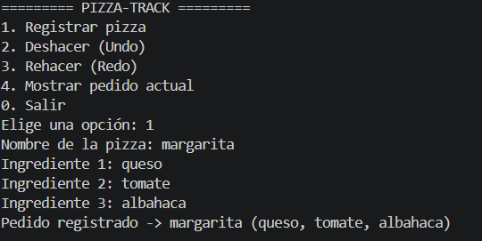
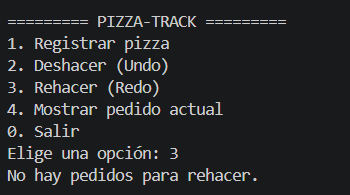
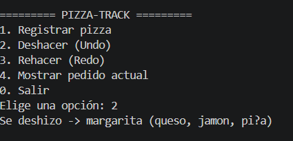
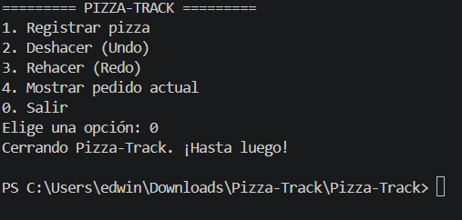

# Pizza-Track

Proyecto desarrollado en Java para gestionar pedidos de una pizzería mediante el uso de pilas y estructuras de datos. La aplicación permite registrar pizzas, deshacer la última acción y rehacerla cuando se necesite.

## Descripción

Pizza-Track es una simulacion la gestión de pedidos de una pizzería usando dos pilas:

- La pila principal guarda los pedidos actuales.
- La pila secundaria guarda los pedidos deshechos para poder recuperarlos.

Esto permite implementar la funcionalidad de Undo/Redo de una forma sencilla y clara, aplicando el concepto de LIFO (Last In, First Out), p. ej., cuando se registra una pizza y luego se desea deshacer la última acción.

## Objetivo

aqui hay que Aplicar el concepto de pila en un caso real de negocio, usando nodos enlazados para construir la estructura sin depender de `java.util.Stack`.

## Características

- Registro de pizzas con nombre e ingredientes.
- Manejo de historial mediante dos pilas.
- Funcionalidad de deshacer y rehacer.
- Consulta del pedido actual.
- Interfaz por consola sencilla y directa.

## Estructura del proyecto

```text
Pizza-Track/
├── src/
│   ├── captura1.png
│   ├── captura2.png
│   ├── captura3.png
│   ├── captura4.png
│   ├── Main.java
│   ├── GestionPedidos.java
│   ├── Pila.java
│   ├── Nodo.java
│   └── Pizza.java
├── bin/
├── README.md
└── .gitignore
```

## ¿Cómo funciona?

La lógica del proyecto es muy simple:

1. El usuario registra una pizza.
2. La pizza entra a la pila principal.
3. Si se elige Deshacer, la última pizza sale de la pila principal y pasa a la secundaria.
4. Si se elige Rehacer, la pizza vuelve a la pila principal.

Esto permite llevar un historial de pedidos sin perder la información, etc.

## Requisitos

- Java JDK instalado.
- Visual Studio Code o cualquier IDE compatible con Java.


## Capturas









## Video de sustentación

*(https://youtu.be/kFpRnwLJxNg
)*

## Autores

edwin bedoya valencia


## Observación

Este proyecto es una buena práctica para entender cómo funcionan las pilas en estructuras de datos, además de aplicar conceptos de programación orientada a objetos en un caso real con una temática sencilla y útil, p. ej., para resolver problemas de control de historial y estados previos.
